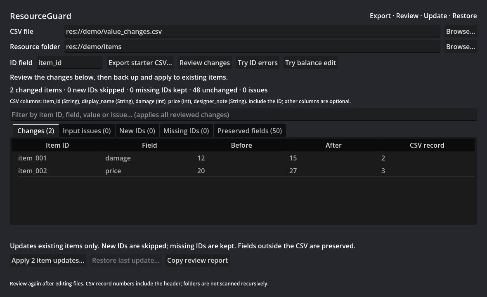
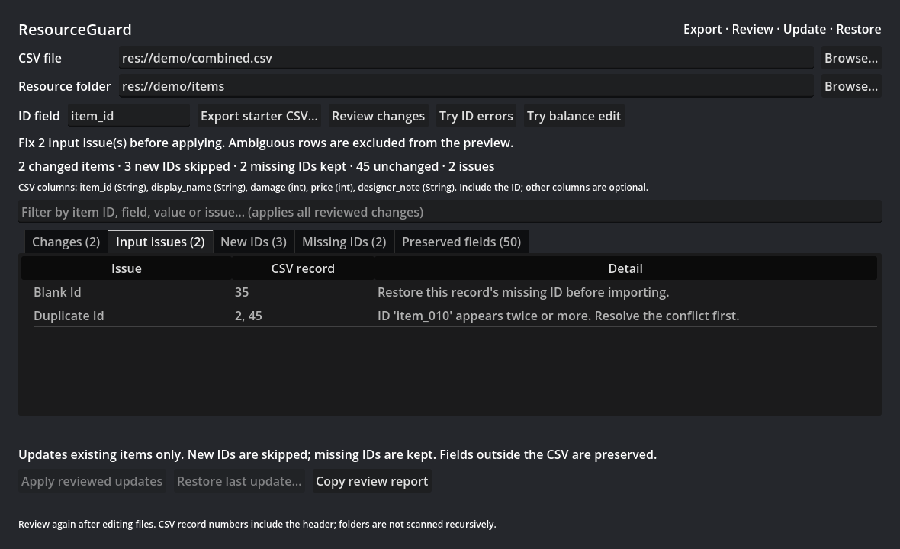
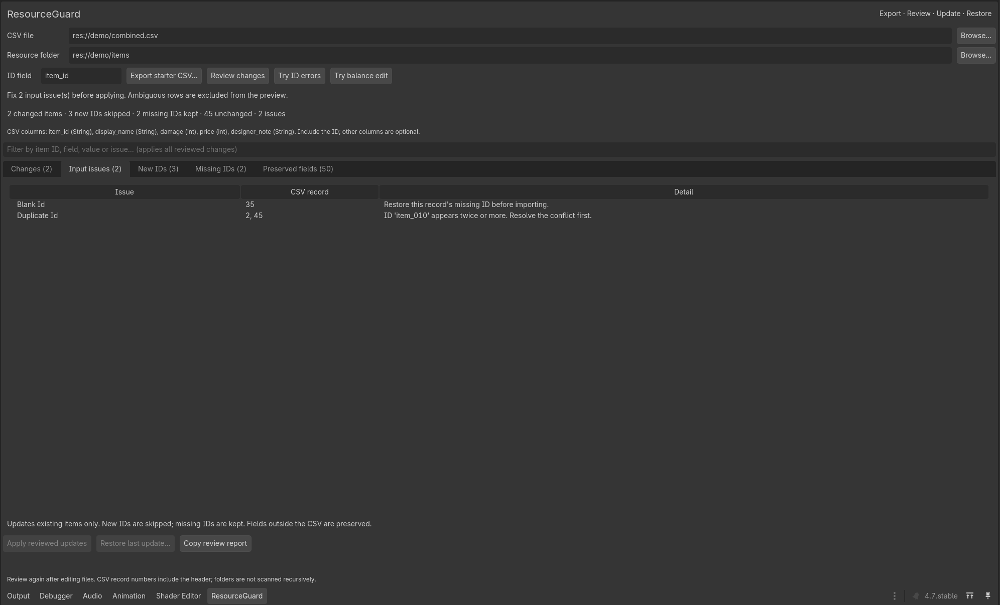
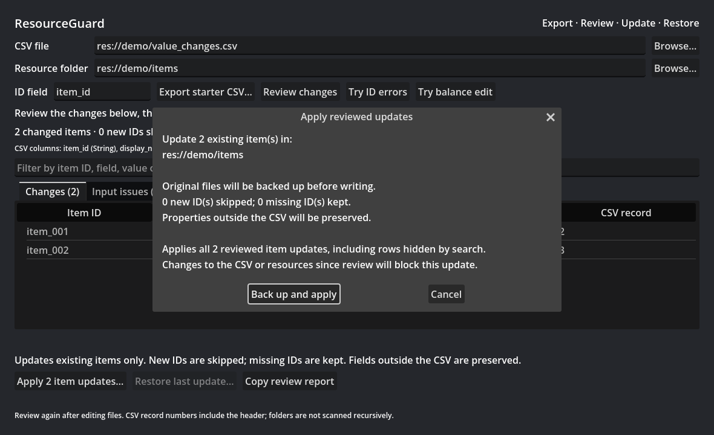

# ResourceGuard

### Review spreadsheet changes before they reach your Godot resources.

ResourceGuard is an in-development Godot editor add-on for balancing existing resource values through CSV files. Export a starter spreadsheet, edit it, inspect the differences, then apply the reviewed changes with backups.

This repository is a visual showcase. It contains screenshots and documentation only; the add-on source and downloadable packages are not published here. ResourceGuard runs inside the Godot editor, not in a browser.

## Review the changes

Match rows by a stable ID and see each field's before-and-after value. Reordering spreadsheet rows does not change which item an ID refers to. Fields omitted from the CSV are preserved.

## Catch input problems

Blank and duplicate IDs are surfaced for correction before applying. New IDs are skipped, while resources missing from the CSV are kept. This build updates existing resources only; it does not create or delete them.

## My guided manual self-test

On September 25, 2026, I opened the ResourceGuard demo in Godot 4.7 on Windows and used **Try ID errors**. I followed step-by-step AI guidance, checked the displayed results myself, and supplied the screenshot below. This is a project-owner self-test, not an independent usability review.

| Test detail | Record |
| --- | --- |
| Input | The supplied `demo/combined.csv` fixture with deliberately invalid IDs; I did not create or edit this fixture during the test |
| Expected | Flag the blank and duplicate IDs and disable Apply |
| Observed | Blank ID at CSV record 35; duplicate `item_010` at records 2 and 45; two input issues reported |
| Apply control | I confirmed **Apply previewed updates** was grayed out; the screenshot also shows it disabled |
| Result | **Pass for this specific UI check**: both ID problems were surfaced and Apply was disabled |

CSV record numbers include the header. This check did not exercise applying valid changes, backups, restore, or editing a CSV in a spreadsheet application. No before-and-after file comparison was performed, so it does not independently establish that files were unchanged.

## Back up, apply, restore

Before writing, the confirmation explains the update and backup behavior. Changes to the CSV or resources since review block that update. **Restore last update** can restore the most recent update when the affected files have not been edited since.

Filtering the review table does not limit an update: applying includes all reviewed changes, even rows hidden by a search.

## The workflow

1. Select a folder of existing `.tres` resources that share a GDScript schema and a unique String or StringName ID field.
2. Export a starter CSV and edit the selected fields in your spreadsheet.
3. Review differences and resolve input issues.
4. Confirm the update, which backs up the original files before writing.
5. Inspect the result and restore the last update if needed.

## Current scope

- Local editor tool: no account, API key, or AI service is required to use it.
- Supports scalar CSV fields in a flat resource folder; nested folders are not scanned.
- Windows with Godot 4.7 is the tested platform for the documented 0.3.1 build.
- The demo uses 50 fictional items. Screenshots are from the prepared demo assets and may differ from later builds.
- Independent human usability and spreadsheet-application testing remain outstanding.

Use a trusted project copy or version control and keep independent backups. Avoid other tools writing to the same resources during review, apply, or restore; this prototype does not provide an exclusive file-writer lock.

**Status:** in development. This showcase does not announce a public release, sale, or download.

---

Another project: **[NPC Decision Lab](https://github.com/chaser777f/npc-decision-lab-showcase)** — a merchant encounter exploring conversation and deterministic game rules.
